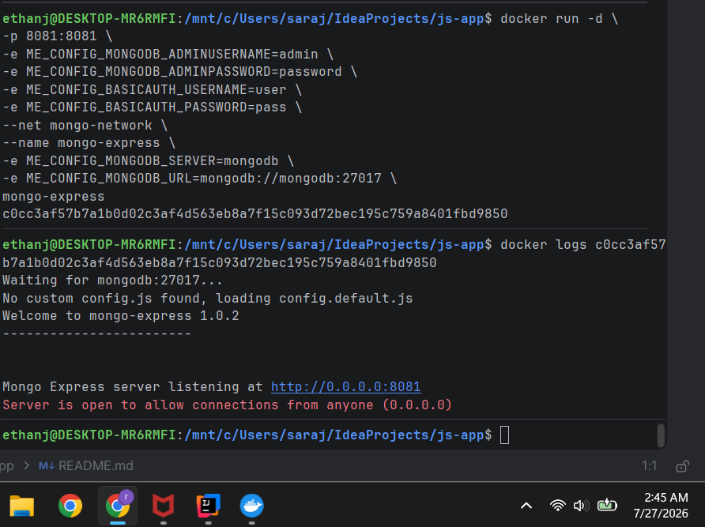
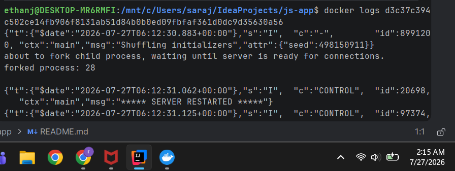
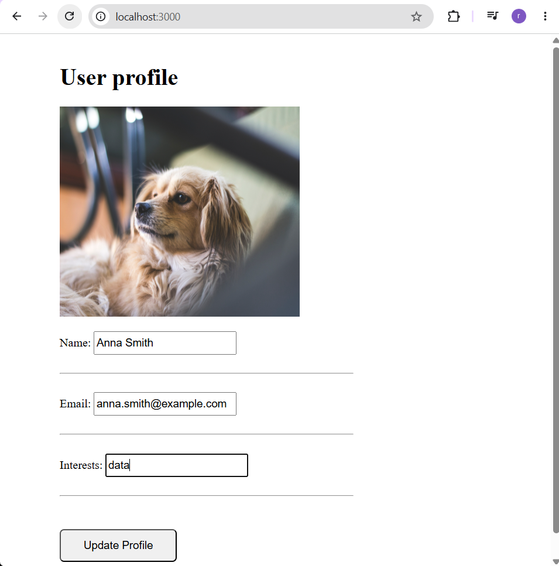
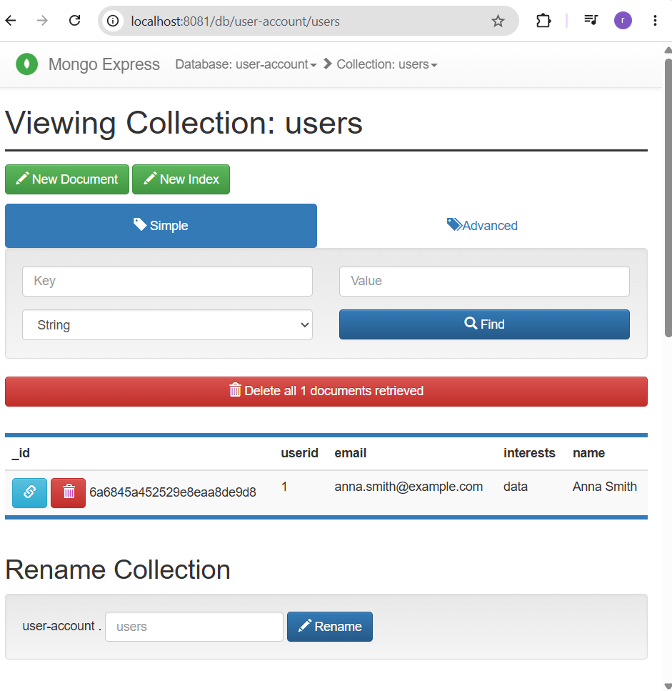

# Dockerized Node.js Application with MongoDB

A multi-container application environment built with **Docker and Docker Compose**, connecting a Node.js application to MongoDB with persistent storage and container-based service discovery.

The project demonstrates container networking, application-to-database connectivity, persistent data management, multi-service orchestration, and troubleshooting across an isolated Docker environment.

---

## Project Overview

The goal of this project was to move a Node.js application and its supporting database into a repeatable containerized environment rather than relying on manually configured local services.

The environment includes:

* Node.js application
* MongoDB database
* Mongo Express administration interface
* Docker networking
* Persistent MongoDB storage
* Docker Compose orchestration

The final environment allows the application and database to communicate using Docker service discovery while preserving database data across container lifecycle events.

---

## Architecture

```text
                        User
                          |
                          v
                  Node.js Application
                          |
                          | MongoDB Connection
                          v
                     MongoDB
                          |
                          v
                  Persistent Volume
                    mongo-data

                          ^
                          |
                    Mongo Express
```

All application services communicate through a Docker-managed network rather than relying on host-level `localhost` connections.

---

## Technology Stack

| Technology        | Purpose                                  |
| ----------------- | ---------------------------------------- |
| Node.js           | Application runtime                      |
| MongoDB           | Application database                     |
| Mongo Express     | Database administration interface        |
| Docker            | Application and service containerization |
| Docker Compose    | Multi-container orchestration            |
| Docker Volumes    | Persistent database storage              |
| Docker Networking | Service-to-service communication         |
| Linux / WSL2      | Development environment                  |

---

## Engineering Decisions

### Containerized Service Architecture

The application, database, and database administration interface were separated into individual containers.

This provides clear service boundaries and makes the environment easier to recreate, troubleshoot, and modify independently.

---

### Docker Service Discovery

Containers cannot use `localhost` to communicate with services running in other containers.

The application was therefore configured to connect to MongoDB using the Docker service/container hostname across the shared Docker network.

This allows Docker's internal DNS system to resolve the database service without hardcoding container IP addresses.

---

### Persistent Database Storage

MongoDB initially depended entirely on the lifecycle of its container.

A Docker named volume was added:

```yaml
volumes:
  mongo-data:
```

The volume is mounted to:

```text
/data/db
```

This separates application data from the container filesystem and allows database records to survive container recreation.

---

### Docker Compose for Environment Management

The environment was moved from individually managed Docker containers to Docker Compose.

This provides a single declarative definition for:

* application services
* networking
* ports
* environment configuration
* dependencies
* persistent volumes

The complete environment can then be started and stopped consistently with:

```bash
docker compose up -d
docker compose down
```

---

## Implementation

The Node.js application was packaged into a Docker image using a custom `Dockerfile`.

MongoDB and Mongo Express were deployed as supporting services and connected through a shared Docker network.

The environment was then defined through Docker Compose so that the entire application stack could be launched consistently from configuration rather than a sequence of individual `docker run` commands.

The application was validated by updating user profile information through the frontend and confirming that the corresponding record was updated inside MongoDB.

---

## Operational Workflow

```text
Application source
      |
      v
Docker image build
      |
      v
Docker Compose
      |
      +----------------+
      |                |
      v                v
 Node.js            MongoDB
                       |
                       v
                  mongo-data
                       ^
                       |
                  Mongo Express
```

The typical lifecycle is:

```bash
docker compose up -d
```

Verify service state:

```bash
docker ps
```

Test the application and database integration.

Stop the environment:

```bash
docker compose down
```

Restart the environment and confirm that database records remain available through the persistent volume.

---

## Validation

The environment was validated at multiple layers.

### Container State

Confirmed that the application, MongoDB, and Mongo Express containers were running successfully.

<!-- Replace with the correct screenshot path if needed -->



### Application Availability

Confirmed that the Node.js application was accessible after deployment.



### Database Integration

A user profile was updated through the application.



The corresponding MongoDB record was then inspected through Mongo Express to confirm that the change had reached the database.



This validates the complete application path:

```text
Frontend
   ↓
Node.js Application
   ↓
MongoDB
   ↓
Persistent Storage
```

---

## Troubleshooting

Several issues required investigation during implementation.

### Application Could Not Reach MongoDB

The application initially encountered database connectivity problems.

The issue involved container networking and how the application referenced the MongoDB service.

Within a Docker environment, `localhost` refers to the container itself rather than another container.

The database connection was updated to use the MongoDB service name available through Docker's internal DNS.

After correcting the connection configuration, the application successfully communicated with MongoDB.

---

### Docker / WSL Integration

Docker commands initially failed because the WSL2 environment was not properly integrated with Docker Desktop.

Docker Desktop WSL integration was enabled for the Linux environment, restoring access to the Docker daemon.

---

### npm Installation Location

`npm install` initially failed because it was executed from a directory that did not contain the application's `package.json`.

The command was rerun from the correct application directory.

---

### Database Persistence

Testing the container lifecycle demonstrated that database storage should not depend on the MongoDB container filesystem.

A named Docker volume was added and mounted to MongoDB's data directory.

The environment was then stopped and recreated to confirm that the existing data remained available.

Detailed implementation steps are preserved in [`IMPLEMENTATION.md`](IMPLEMENTATION.md).

---

## Security Considerations

This project was created as a hands-on engineering environment rather than a production deployment.

Several configuration choices would need to be strengthened before production use.

Current areas for improvement include:

* Move database credentials out of the Docker image and source-controlled configuration.
* Store sensitive configuration using environment variables or a secrets-management solution.
* Restrict Mongo Express access.
* Avoid exposing the MongoDB port externally unless specifically required.
* Use application-specific database accounts with least-privilege permissions.
* Use controlled and immutable container image versions rather than relying on broad image tags.

The current Dockerfile includes development credentials for the lab environment. These should not be used as a production credential-management pattern.

---

## What This Project Demonstrates

This project demonstrates practical experience with:

* containerizing an application
* building multi-container environments
* Docker networking
* container DNS and service discovery
* application-to-database connectivity
* Docker Compose
* persistent storage using Docker volumes
* container lifecycle management
* troubleshooting distributed application components
* validating application changes through the database layer

---

## Future Enhancements

Potential improvements include:

* externalizing all application and database credentials
* adding container health checks
* adding automated application tests
* integrating the project with Jenkins CI/CD
* publishing images through a managed or private container registry
* deploying the application to AWS
* centralized application and container logging
* infrastructure provisioning with Terraform
* migrating the environment to Kubernetes after the container architecture is stable

---

## Repository Documentation

* [`README.md`](README.md) — engineering overview and project results
* [`IMPLEMENTATION.md`](IMPLEMENTATION.md) — detailed implementation record

---

## Engineering Outcome

The project evolved from manually managed application and database services into a repeatable multi-container environment.

The final architecture demonstrates how Docker networking, persistent storage, service isolation, and Compose-based orchestration can be combined to create a more portable and maintainable application environment.
